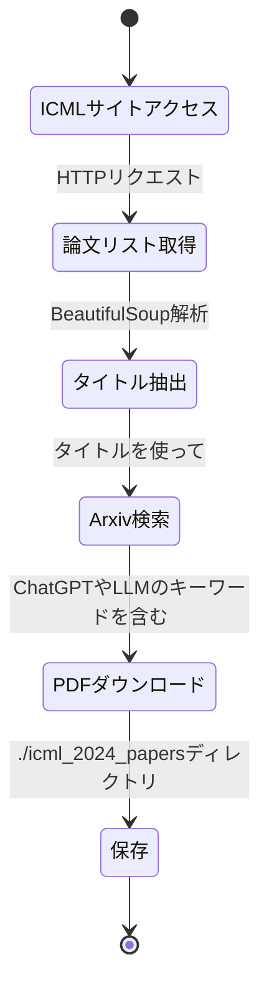
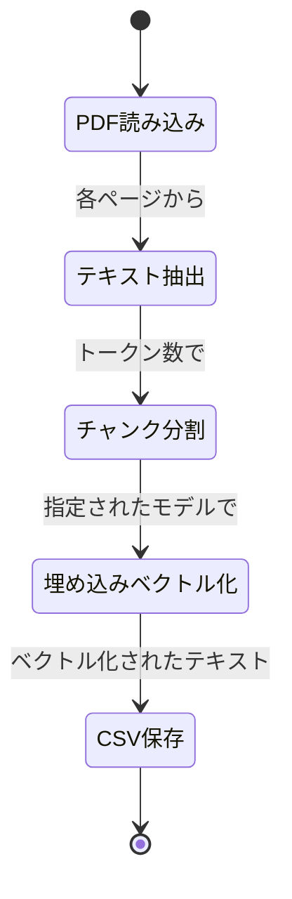
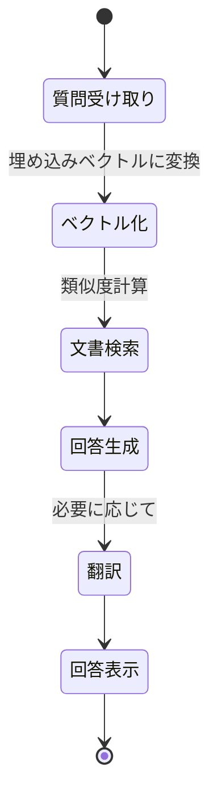
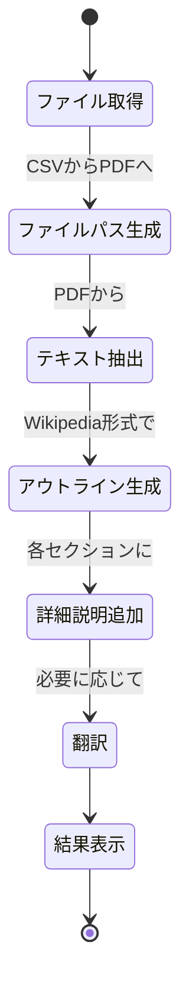

# LLMのRAGを使ったQABOT

---

## アジェンダ

1. システム概要
2. 全体の動作フロー
3. 動作動画
4. データ取得の状態遷移図
5. データの埋め込みベクトル化の状態遷移図
6. QAの動作フローと状態遷移図
7. まとめ

---

## システム概要

RAGQABotを作成、動作例として、ICML 2024の論文PDFを取得し、PDFから抽出したテキストを埋め込みベクトル化し、質問に対して関連する文書を検索し、その文書を基に回答を生成するRAG（Retrieval-Augmented Generation）モデルを使用したQABOTです。

使用するデータはICML 2024の寄稿論文の中からLLMに関連する2634件中の306件の論文を使用しています。

---

## 全体の動作フロー

### 前処理部分

1. データ取得:
    - ICML 2024の論文PDFを取得し、./icml_2024_papersディレクトリに格納する
2. データの埋め込みベクトル化:
    - 取得したPDFからテキストを抽出し、ベクトル化する

### QA部分

3. LLMのRAGモデルの設定:
    - 質問に対して関連する文書を検索し、その文書を基に回答を生成する
4. QABOTの構築:
    - ユーザーインターフェースを作成し、ユーザーからの質問に対してRAGモデルを使って回答するQABOTを構築する

---

## 動作動画

---

## データ取得の状態遷移図

---

## データの埋め込みベクトル化の状態遷移図

---

## QAの動作フローと状態遷移図

### 動作フロー

1. ユーザーの質問を受け取る
2. 質問を埋め込みベクトルに変換
3. 質問に対して関連する文書を検索
4. 関連する文書を基に回答を生成
5. 必要に応じて回答を日本語に翻訳
6. 回答をユーザーインターフェースに表示

### 状態遷移図

---

## QAで使用した文章自体のアウトラインを生成

### 動作フロー

1. 回答に使用したファイルを取得
2. ファイルパスを生成
3. PDFからテキストを抽出
4. Wikipedia風のアウトラインを生成
5. 詳細な説明を追加
6. 必要に応じて翻訳
7. 結果を表示

### 状態遷移図

---

## まとめ

この機能設計書を基に、システム全体の構築と運用を行うことができます。各機能の詳細仕様とその実装方法が明確に記載されているため、開発チームはこれを参照しながら効率的に作業を進めることができます。

---

## Appendix

### QAの出力例

**質問:** RAGを使ったフレームワークやLLMオーケストレーションフレームワーク、Agentについての資料の中でどのようなことをを提案しているかを順番に過不足なく説明してください。

**回答:**

提供されたコンテキストでは、DFA-RAGフレームワークについて説明されており、大規模言語モデルと決定性有限オートマトンを組み合わせて会話エージェントを強化します。以下は、提案の段階ごとの説明書に基づく手順です：

1. **DFA-RAGフレームワークの導入**：
- DFA-RAGフレームワークは、従来の大規模言語モデル（LLMs）が予め定義された応答ガイドラインを持つシナリオで規制された適合応答を生成する際に直面する課題に対処するために導入されています。
- このフレームワークは、トレーニング対話から学習された決定性有限オートマトン（DFA）をLLM内に埋め込み、LLMが決定論的な応答経路に従うように導くセマンティックルーターとして機能します。
1. **RAGを用いたルーティング戦略**：
- ルーティング戦略は、リトリーバル-拡張生成（RAG）戦略を通じて達成され、現在の会話コンテキストに合わせたダイアログ例を選択します。
- DFA-RAGの利点には、人間が読み取れるDFAを介した解釈可能な構造、会話中の応答のためのコンテキストに敏感なリトリーバル、既存のLLMsとの互換性が含まれます。
1. **RAGコンセプトの拡張**：
- 提案されたフレームワークは、歴史的な対話がDFAに符号化され、それらに基づいて類似の対話を取得することにより、RAGコンセプトの拡張と見なすことができます。
- このアプローチは、応答生成に構造化されたアプローチを提供することで、会話エージェント研究において先駆的な一歩を示しています。
1. **タスク志向型ダイアログシステム**：
- DFA-RAGフレームワークは、特にタスク志向型ダイアログシステムにおいて、LLMsの信頼性を高めることを目指しています。
- このフレームワークは、従来の勾配ベースのトレーニングに依存せず、新しいシナリオへの簡単な調整のためのシンプルさと適応性を提供する独自のアプローチを導入しています。
1. **セマンティックルーターの進化**：
- DFA-RAGは、セマンティックルーターテクノロジーの進化と見なされ、タグを使用して意思決定層をナビゲートし、解釈可能性と計算効率を向上させる利点を提供しています。
- 人間によって事前に定義された意思決定層とは異なり、フレームワーク内のDFA構造は歴史的なトレーニングデータから学習されるため、現実世界のアプリケーションにより適応性がありスケーラビリティがあります。

**結論:** DFA-RAGフレームワークは、DFAとLLMsを組み合わせることで、さまざまなシナリオでコンテキストに敏感で規制遵守の応答を提供することで、会話エージェントの機能を強化する構造化されたアプローチを提案しています。

**この回答に使用した資料**:

- PinNet: Pinpoint Instructive Information for Retrieval Augmented Code-to-Text Generation.pdf
- DFA-RAG: Conversational Semantic Router for Large Language Model with Definite Finite Automaton.pdf
- RigorLLM: Resilient Guardrails for Large Language Models against Undesired Content.pdf

---

### アウトラインの出力例

説明対象ファイル名: ./papers/DFA-RAG Conversational Semantic Router for Large Language Model with Definite Finite Automaton.pdf

以下は、「DFA-RAG: Definite Finite Automatonを用いた大規模言語モデルの会話セマンティックルーター」に基づいて詳細に解説されたWikipediaページのアウトラインの拡張版です。

## DFA-RAG: Definite Finite Automatonを用いた大規模言語モデルの会話セマンティックルーター

## はじめに
DFA-RAGフレームワークは、Definite Finite Automaton（DFA）と大規模言語モデル（LLMs）を組み合わせることで会話エージェントを管理する革新的な手法を表しています。このハイブリッドアプローチは、対話システムにおいてより一貫性があり、規制され、文脈的に適切な応答を提供することを目指しています。

## 背景
### 大規模言語モデル（LLMs）
LLMsは、人間の言語を理解し生成するために設計された高度な機械学習モデルです。LLMsは膨大なデータセットでトレーニングされ、文脈的に関連性があり多様な応答を生成することができます。代表的な例には、OpenAIのGPT-3やGoogleのBERTがあります。

### Definite Finite Automaton（DFA）
DFAは、計算の理論モデルであり、一連の操作を表現して制御するために使用されます。会話エージェントの文脈では、DFAは対話の流れを調整し、応答が事前に定められたパターンと規則に従うことを保証するために活用されます。

### 伝統的な会話エージェント
伝統的な会話エージェントは、しばしばルールベースシステムやより単純な機械学習モデルに依存しています。特定のシナリオでは効果的ですが、LLMsが提供する柔軟性や文脈理解力に欠けることがあります。

## 会話エージェントの課題
### 規制された応答とコンプライアンス
会話エージェントの応答が規制やコンプライアンス要件と一致していることを確保することは重要な課題です。特に、医療、金融、顧客サービスなどの領域では特に重要です。

### 特別なシナリオ：感情的なサポートと顧客サービス
感情的なサポートを提供したり、顧客サービスの問題に対処するような感情や複雑なシナリオを処理するには、エージェントが共感的で正確であることが求められます。伝統的なシステムはこれらの複雑な相互作用においてしばしば不十分です。

## DFA-RAGフレームワーク
### 概要
DFA-RAGフレームワークは、DFAとLLMsを組み合わせて会話の流れを管理することを目的としています。このハイブリッドモデルは、DFAの構造化された性質とLLMsの生成能力を活用して規制された文脈を持ち、意識的な応答を生成します。

### 情報取得増強生成（RAG）
RAGは、応答生成を強化する技術であり、応答を生成する前にデータベースや知識ベースから関連情報を取得することで、文脈的に適切で事実に基づいた応答を保証します。

### DFAとLLMsの統合
この統合は、会話の流れをガイドするためにDFAを使用し、実際の応答を生成するためにLLMsを使用します。この組み合わせにより、会話が論理的でコンプライアンスが取れ、一方で人間の言語の柔軟性と自然さが維持されます。

## 方法論
### 問題設定
#### データ設定
データ設定には、顧客サポートや感情サポートサービスなどの様々なドメインからのダイアログデータセットの収集と前処理が含まれます。

#### ゴール
主なゴールは、規制された応答を持つ複雑な相互作用を処理し、会話の一貫性と文脈的適合性を維持しながら会話エージェントを開発することです。

### DFAを使った会話モデリング
#### DFAの前提条件
DFAの詳細な説明であり、状態、遷移、および会話などの逐次データをモデル化する方法について説明します。

#### タグシーケンスとしての会話
会話は、異なる対話行為や状態を表すタグのシーケンスに分解され、それらはDFAのトレーニングに使用されます。

#### 会話セットをDFAとして
複数の会話が集約されて、様々な会話の流れを処理できる包括的なDFAが形成されます。

### 会話からDFAを学習
#### LLMsを使用して会話からタグシーケンスを抽出
LLMsは会話を分析し、異なる対話状態を表すタグのシーケンスを抽出するために使用されます。

#### タグシーケンスでツリー構築
これらのタグシーケンスは、会話の構造を捉えるツリーの構築に使用されます。

#### タグツリーでの状態統合
似た状態をマージすることで、より効率的なDFAが生まれます。

### DFA-RAGによる会話生成
#### ユーザの発話にタグ付け
ユーザの入力は、DFAを使用して適切な対話状態にタグ付けされます。

#### DFAをナビゲート
システムは、タグ付けされたユーザ入力に基づいてDFAをナビゲートし、次の状態を決定します。

#### ダイアログIDの取得
DFA内の各状態は、特定の応答に対応する特定のダイアログIDと関連付けられています。

#### LLM向けのプロンプトの編集
現在の状態と会話の文脈に基づいてLLM向けのプロンプトが編集されます。

#### LLMによる応答生成
LLMは、編集されたプロンプトに基づいて応答を生成し、文脈的に適切でコンプライアンスを保証します。

#### 反復プロセス
このプロセスは反復的であり、各ユーザの入力が新しいサイクルのタグ付け、ナビゲーション、応答生成を引き起こします。

## 実験結果
### データセット
実験は、AmazonHelp、DeltaSupport、AskPlayStation、AirbnbHelp、NikeSupport、およびCambridgeInfo/MultiWOZデータセットからの顧客サポートインタラクションなど、様々なドメインのデータセットで実施されました。

### 生成品質評価
#### 評価手法
生成された応答の品質は、BLEUスコアなどの自動化されたメトリクスと人間による評価を使用して評価されました。

#### ベースライン
DFA-RAGのパフォーマンスは、伝統的なLLMベースシステムとルールベースシステムと比較されました。

#### 観察
結果は、DFA-RAGが規制され、一貫性があり、文脈的に関連性がある応答を生成する点でベースラインを上回ることを示しました。

### 対話タスクの評価
具体的な対話タスクを使用して、システムが複雑な相互作用を処理し、会話の流れを維持する能力を評価しました。

### 構築されたDFAのデモンストレーション
#### AmazonHelp
DFA-RAGは、Amazonの顧客サポートインタラクションを効果的に管理し、応答がコンプライアンスを保ち、助けになるようにしました。

#### DeltaSupport
システムは航空会社の顧客サービスシナリオを処理し、正確で共感的な応答を提供しました。

#### AskPlayStation
DFA-RAGは、PlayStationユーザー向けの技術サポートを管理し、効果的にさまざまな問題に対処しました。

#### AirbnbHelp
フレームワークはAirbnbの顧客サービスインタラクションでテストされ、予約やサービスに関する問い合わせを処理できる能力を示しました。

#### NikeSupport
Nikeの顧客サポートシナリオを使用して、製品の問い合わせやサポート要求の処理性能を評価しました。

#### CambridgeInfo/MultiWOZ
DFA-RAGは、多様な対話シナリオを含むCambridgeInfo/MultiWOZデータセットでテストされ、その堅牢性と柔軟性がさらに示されました。

## 議論と今後の展望
### 分布外の発話の処理
今後の研究は、分布外の発話を処理するシステムの能力を向上させることに焦点を当てる予定です。予期せぬ入力を効果的に処理できるようにします。

### 外部モジュールとの統合
知識ベースやリアルタイムデータソースなどの外部モジュールの統合を探求し、システムの機能を向上させることを目指します。

## 関連研究
### 構造化対話システム
既存の構造化対話システムとDFA-RAGとの比較についての概要。

### 情報取得増強生成（RAG）
RAG技術とその会話エージェントへの応用についての議論。

### タスク指向対話システム
タスク指向の対話システムとその限界について、DFA-RAGが対処しようとしている問題の検証。

### セマンティックルーター
セマンティックルーターに関する議論と、会話の流れを管理する上での役割について。

## 結論
DFA-RAGフレームワークの主要な貢献と、高度な会話エージェントの開発における潜在的な影響をまとめたもの。

## 参考文献
科学論文で引用された包括的な参考文献リストで、興味を持つ読者向けの追加情報提供。

## 外部リンク
関連するリソース、ツール、およびリポジトリへのリンクなど、さらなる探求のためのリンク。

## 関連項目
追加の文脈と情報提供のための関連Wikipedia記事やリソースへのリンク。

---
